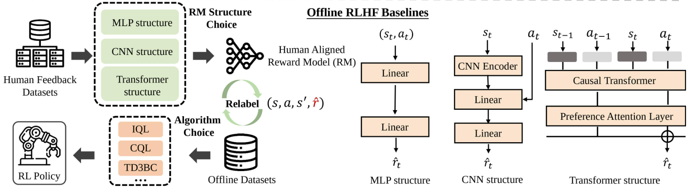

# Clean-Offline-RLHF

<p align="center">
<a href="https://uni-rlhf.github.io/">Project Website</a>
·
<a href="https://arxiv.org/abs/2402.02423">Paper</a>
·
<a href="">Platform</a>
·
<a href="https://drive.google.com/drive/folders/1JMWyl0iAm2JJ5pOBW5M9kTOj6pJn8H3N?usp=drive_link">Datasets</a>
·
<a href="https://github.com/thomas475/Uni-RLHF">Clean Offline RLHF</a>
</p>

This is the official PyTorch implementation of the paper "[Uni-RLHF: Universal Platform and Benchmark Suite for Reinforcement Learning with Diverse Human Feedback](https://arxiv.org/abs/2402.02423)". Clean-Offline-RLHF is an Offline Reinforcement Learning with Human Feedback codebase that provides high-quality and realistic human feedback implementations of offline RL algorithms. 
<p align="center">
    <br>
    
    <br>
<p>

## 💡 News

- **[03-26-2024]** 🔥 Update Mini-Uni-RLHF, a minimal out-of-the-box annotation tool for researchers, powered by [streamlit](https://streamlit.io/).  
- **[03-24-2024]** Release of [SMARTS](https://github.com/huawei-noah/SMARTS) environment training dataset, scripts and labels. You can find it 
in the [smarts branch](https://github.com/pickxiguapi/Clean-Offline-RLHF/tree/smarts).
- **[03-20-2024]** Update detail setup bash files.  
- **[02-22-2024]** Initial code release.    


## 🛠️ Getting Started

### Installation on Linux (Ubuntu)

1. Clone the repo
   ```sh
   git clone https://github.com/thomas475/Clean-Offline-RLHF.git
   cd Clean-Offline-RLHF
   ```
2. Setup Anaconda environment
    ```sh
    conda create -n rlhf python==3.9
    conda activate rlhf
    ```
3. Install Dependencies
    ```sh
    pip install -r requirements.txt
    ```
4. Install hdf5
    ```sh
    conda install anaconda::hdf5
    ```
5. Install Torch
    * For GPU Support (CUDA):

        ```pip install torch==1.13.1+cu117 torchvision==0.14.1+cu117 torchaudio==0.13.1 --extra-index-url https://download.pytorch.org/whl/cu117```
    
    * For CPU Only:
    
        ```pip install torch==1.13.1+cpu torchvision==0.14.1+cpu torchaudio==0.13.1 --extra-index-url https://download.pytorch.org/whl/cpu```
   
### MuJoCo

Many of the datasets use MuJoCo as environment, so it should be installed, too. See [this](https://gist.github.com/saratrajput/60b1310fe9d9df664f9983b38b50d5da) for further details.

1. Download the MuJoCo library:
    ```sh
    wget https://mujoco.org/download/mujoco210-linux-x86_64.tar.gz
    ```
2. Create the MuJoCo folder:
    ```sh
    mkdir ~/.mujoco
    ```
3. Extract the library to the MuJoCo folder:
    ```sh
    tar -xvf mujoco210-linux-x86_64.tar.gz -C ~/.mujoco/
    ```
4. Add environment variables (run `nano ~/.bashrc`):
    ```sh
    export LD_LIBRARY_PATH=$LD_LIBRARY_PATH:$HOME/.mujoco/mujoco210/bin
    export MUJOCO_GL=egl
    ```
5. Reload the .bashrc file to register the changes.
    ```sh
    source ~/.bashrc
    ```
6. Install dependencies:
    ```sh
    conda install -c conda-forge patchelf fasteners cython==0.29.37 cffi pyglfw libllvm11 imageio glew glfw mesalib
    sudo apt-get install libglew-dev
    ```
7. Test that the library is installed.
    ```sh
    cd ~/.mujoco/mujoco210/bin
    ./simulate ../model/humanoid.xml
    ``` 

## 💻 Usage

### Human Feedback

Before using offline RLHF algorithm, you should annotate your dataset using human feedback. If you wish to collect labeled dataset to new tasks, we refer to [platform]() part for crowdsourced annotation. Here, we provide a ~15M steps crowdsourced annotation dataset for the sample task. [raw dataset](https://drive.google.com/drive/folders/1JMWyl0iAm2JJ5pOBW5M9kTOj6pJn8H3N?usp=drive_link). 

The processed crowdsourced (CS) and scripted teacher (ST) labels are located at [crowdsource_human_labels](crowdsource_human_labels/) and [generated_fake_labels](generated_fake_labels/) folders.

Note: for comparison and validation purposes, we provide fast track for scripted teacher (ST) label generation in `fast_track/generate_d4rl_fake_labels.py`.

### Prepare Crowdsourced Data

The exported labels from the Uni-RLHF-Platform have to be transformed into an approprite format first. To do this the following script (replace `[dir_path]` with the location of the raw labels):
```bash
cd scripts
python3 transform_raw_labels.py --data_dir [dir_path]
```

### Pre-train Auxiliary Models

You can configure the training of the auxiliary models (reward model, attribute mapping model, keypoint prediction model) by creating a custom `config.yaml` file (available parameters can be seen in `TrainConfig` object in `rlhf/train_model.py`). To then train these models you run the following command:
```bash
cd rlhf
python3 train_model.py --config config.yaml
```

### Train Offline RL with Pre-trained Auxiliary Models 

Following Uni-RLHF codebase implemeration, we modified `IQL`, `CQL` and `TD3BC` algorithm. You can adjust the details of the experiments in the `TrainConfig` objects in the algorithm implementations found in `/algorithms/offline`, as well as in the files in the `/config` directory.

Example: Train with implicit Q-learning. The log will be uploaded to [wandb](https://wandb.ai/site).
```bash
python3 algorithms/offline/iql_p.py
```

These are the possible variations of algorithms, feedback types, label types, and auxiliary model types:

| Algorithm | Feedback Type | Label Type | Auxiliary Model Type |
|-----------|---------------|------------|----------------------|
| IQL       | COMPARATIVE   | CS         | MLP                  |
| CQL       | ATTRIBUTE     | ST         | TFM                  |
| TD3BC     | EVALUATIVE    |            | CNN                  |
|           | KEYPOINT      |            |                      |


<!-- LICENSE -->
## 🏷️ License

Distributed under the MIT License. See `LICENSE.txt` for more information.

<!-- CONTACT -->
## ✉️ Contact

For any questions, please feel free to email yuanyf@tju.edu.cn.

<!-- CITATION -->
## 📝 Citation

If you find our work useful, please consider citing:
```
@inproceedings{anonymous2023unirlhf,
    title={Uni-{RLHF}: Universal Platform and Benchmark Suite for Reinforcement Learning with Diverse Human Feedback},
    author={Yuan, Yifu and Hao, Jianye and Ma, Yi and Dong, Zibin and Liang, Hebin and Liu, Jinyi and Feng, Zhixin and Zhao, Kai and Zheng, Yan}
    booktitle={The Twelfth International Conference on Learning Representations, ICLR},
    year={2024},
    url={https://openreview.net/forum?id=WesY0H9ghM},
}
```

